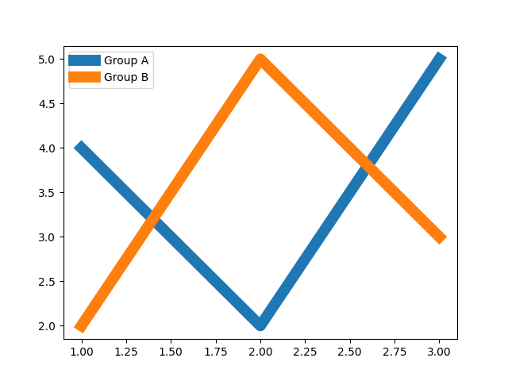
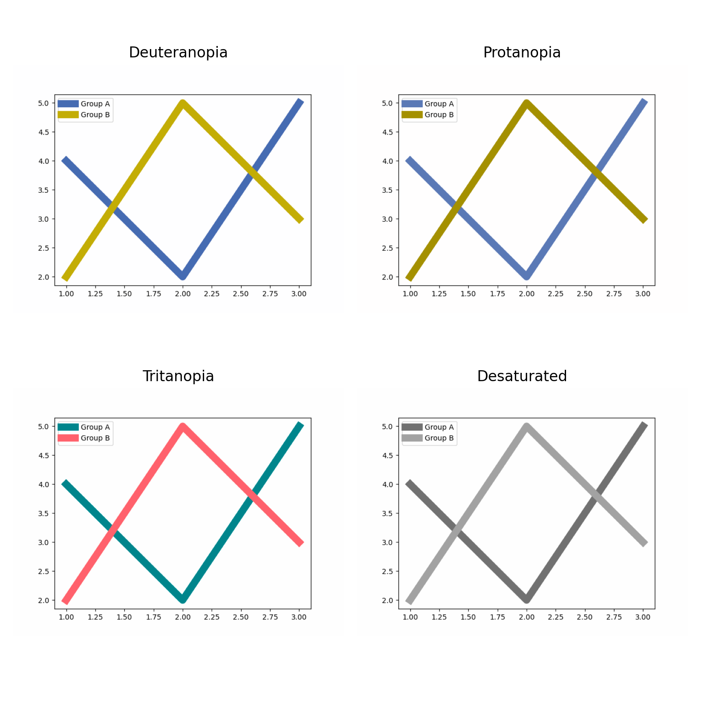
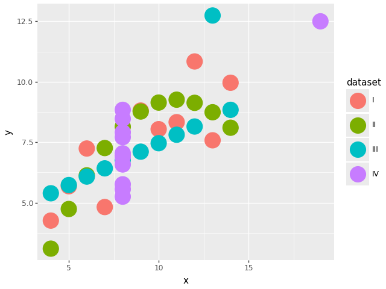
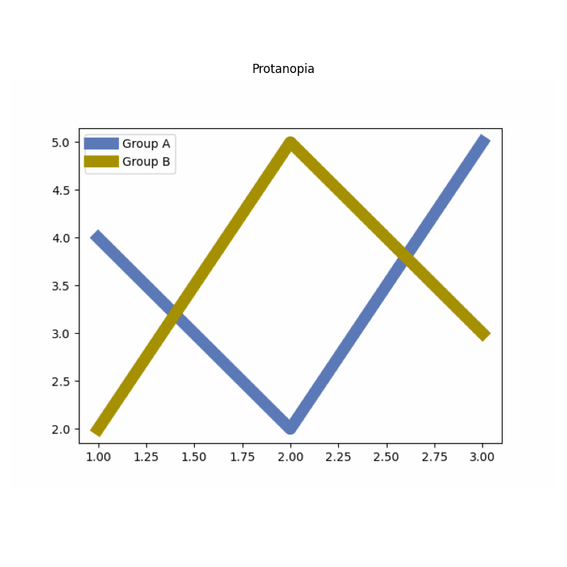
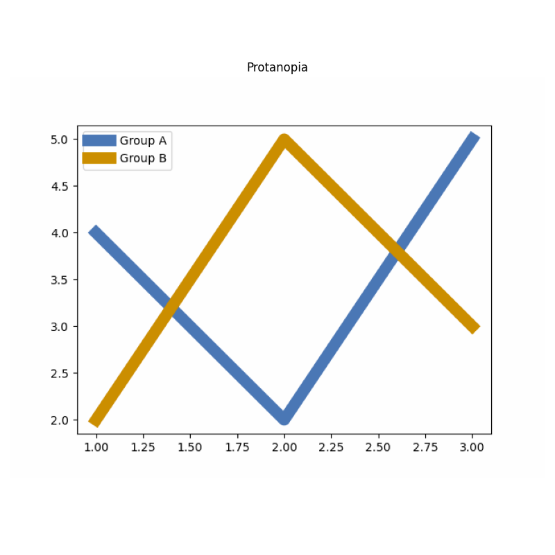

# realcolor: simulate colorblindness in Python charts

`realcolor` is a lightweight Python package designed to show **how colorblind people see your graphs**. It simulates all types of colorblindness (deuteranopia, protanopia, tritanopia) by showing you your graphic as seen by a colorblind person. It works with _matplotlib and everything built on top of it_ (seaborn, plotnine, etc).

> [!NOTE]
> Colorblindness affects up to 1 in 12 males (8%) and 1 in 200 females (0.5%)[^1]

<br>

## Installation

```bash
pip install realcolor
```

<br>

## Quick start

- Matplotlib

```python
import matplotlib.pyplot as plt

fig, ax = plt.subplots()
ax.plot([1, 2, 3], [4, 2, 5], label="Group A", lw=4)
ax.plot([1, 2, 3], [2, 5, 3], label="Group B", lw=4)
ax.legend()
```



```python
from realcolor import simulate_colorblindness

simulate_colorblindness(fig)
```



- Plotnine

```python
from plotnine import ggplot, geom_point, aes
from plotnine.data import anscombe_quartet
from realcolor import simulate_colorblindness

ggp = ggplot(anscombe_quartet, aes(x="x", y="y", color="dataset")) + geom_point(size=10)
simulate_colorblindness(ggp)
```



> [!TIP]
> Looking for support of other data visualization libraries? [Open an issue](https://github.com/y-sunflower/realcolor/issues).

<br>

## Other features

- Simulate just one kind of colorblindness (one of `"deuteranopia"`, `"protanopia"`, `"tritanopia"`, `"desaturated"`):

```python
simulate_colorblindness(fig, kind="protanopia")
```



- Control the severity of the simulation (between 0 to 100, default to 100):

```python
simulate_colorblindness(fig, kind="protanopia", severity=50)
```



- Score how colorblind-friendly a set of colors is (0 = indistinguishable, 100 = perfectly distinguishable):

```python
from realcolor import colorblind_score

score = colorblind_score(["red", "green", "blue"])

score.overall
#> 52.1

score.deuteranopia
#> {"score": 66.7, "min_deltaE": 16.7, "worst_pair": ("#ff0000", "#008000")}
```

<br>

[^1]: Deane B. Judd, "Facts of Color-Blindness\*," J. Opt. Soc. Am. 33, 294-307 (1943)
