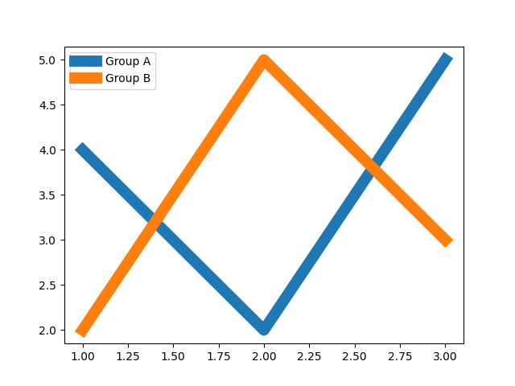
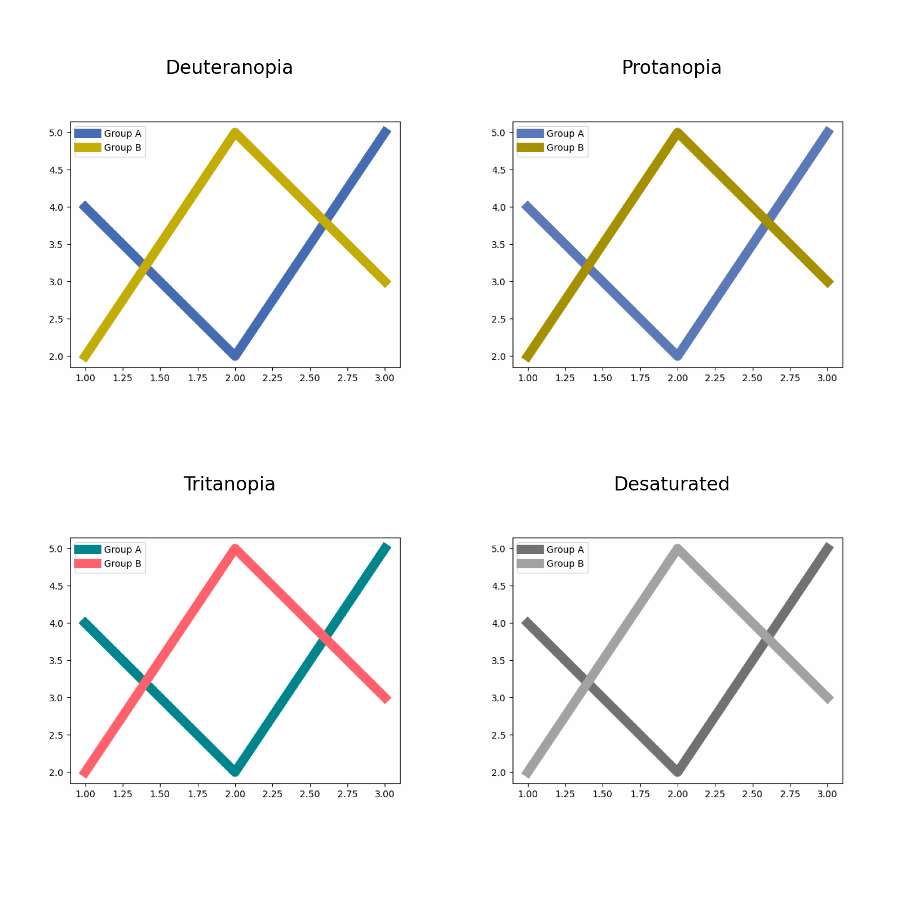
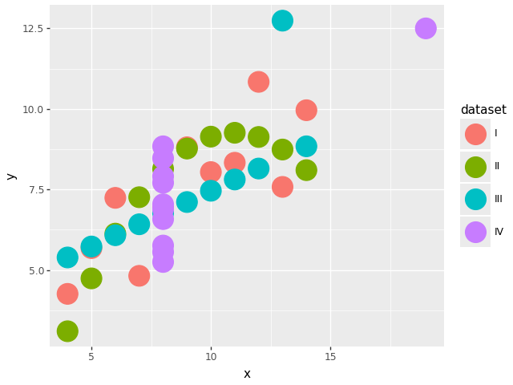
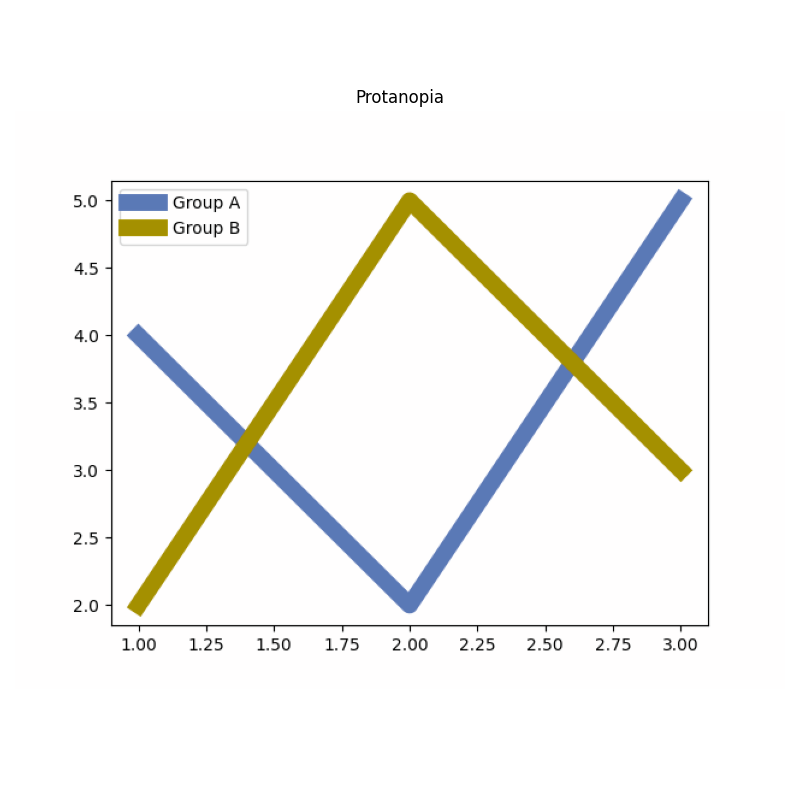
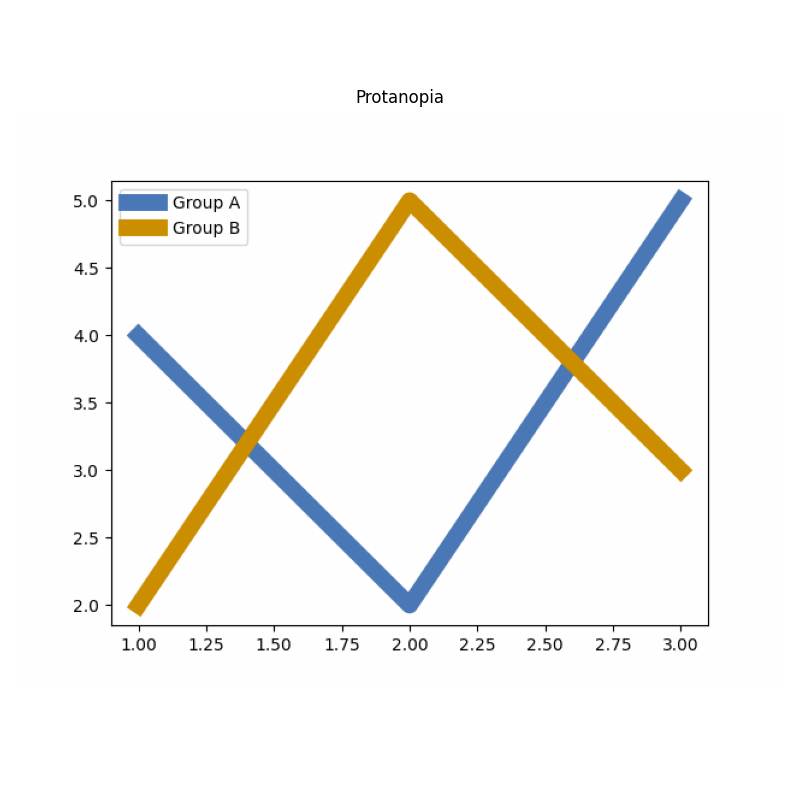

# realcolor: simulate colorblindness in Python charts

`realcolor` is a lightweight Python package designed to show **how colorblind people see your graphs**. It simulates all types of colorblindness (deuteranopia, protanopia, tritanopia) by showing you your graphic as seen by a colorblind person. It supports Matplotlib-based plots and Plotly figures.

> [!NOTE]
> Colorblindness affects up to 1 in 12 males (8%) and 1 in 200 females (0.5%)[^1]

<br>

## Installation

```bash
pip install realcolor[matplotlib]
```

For Plotly support, install the Plotly backend instead:

```bash
pip install realcolor[plotly]
```

The Plotly backend uses Kaleido to rasterize the source figure. Current Kaleido versions may also require a compatible Chrome or Chromium installation.

<br>

## Quick start

- Matplotlib

```python
import matplotlib.pyplot as plt

fig, ax = plt.subplots()
ax.plot([1, 2, 3], [4, 2, 5], label="Group A", lw=4)
ax.plot([1, 2, 3], [2, 5, 3], label="Group B", lw=4)
ax.legend()
```



```python
from realcolor import simulate_colorblindness

simulate_colorblindness(fig)
```



- Plotnine

```python
from plotnine import ggplot, geom_point, aes
from plotnine.data import anscombe_quartet
from realcolor import simulate_colorblindness

ggp = ggplot(anscombe_quartet, aes(x="x", y="y", color="dataset")) + geom_point(size=10)
simulate_colorblindness(ggp)
```



- Plotly

```python
import plotly.express as px
from realcolor import simulate_colorblindness

fig = px.scatter(
    x=[1, 2, 3, 4],
    y=[4, 2, 5, 3],
    color=["Group A", "Group A", "Group B", "Group B"],
)
simulated = simulate_colorblindness(fig, width=800, height=800)
simulated.show()
```

> [!TIP]
> Looking for support of other data visualization libraries? [Open an issue](https://github.com/y-sunflower/realcolor/issues).

<br>

## Other features

- Simulate just one kind of colorblindness (one of `"deuteranopia"`, `"protanopia"`, `"tritanopia"`, `"desaturated"`):

```python
simulate_colorblindness(fig, kind="protanopia")
```



- Control the severity of the simulation (between 0 to 100, default to 100):

```python
simulate_colorblindness(fig, kind="protanopia", severity=50)
```

Matplotlib-based plots use `figsize=(width, height)` in inches. Plotly figures use their native `width` and `height` arguments in pixels.



- Score how colorblind-friendly a set of colors is (0 = indistinguishable, 100 = perfectly distinguishable):

```python
from realcolor import colorblind_score

score = colorblind_score(["red", "green", "blue"])

score.overall
# > 52.1

score.deuteranopia
# > {"score": 66.7, "min_deltaE": 16.7, "worst_pair": ("#ff0000", "#008000")}
```

<br>

## Contributing

- Fork the repository to your own GitHub account.

- Clone your forked repository to your local machine (ensure you have [Git installed](https://git-scm.com/book/en/v2/Getting-Started-Installing-Git)):

```bash
git clone https://github.com/YOUR_NAME/realcolor.git
cd realcolor
```

- Create a new branch:

```bash
git checkout -b my-feature
```

- Set up your Python environment (ensure you have [uv installed](https://docs.astral.sh/uv/getting-started/installation/)):

```bash
uv sync --all-extras --dev
uv run pre-commit install
uv pip install -e .
```

- Test that everything works correctly by running:

```bash
uv run pytest
```

<br>

[^1]: Deane B. Judd, "Facts of Color-Blindness\*," J. Opt. Soc. Am. 33, 294-307 (1943)
